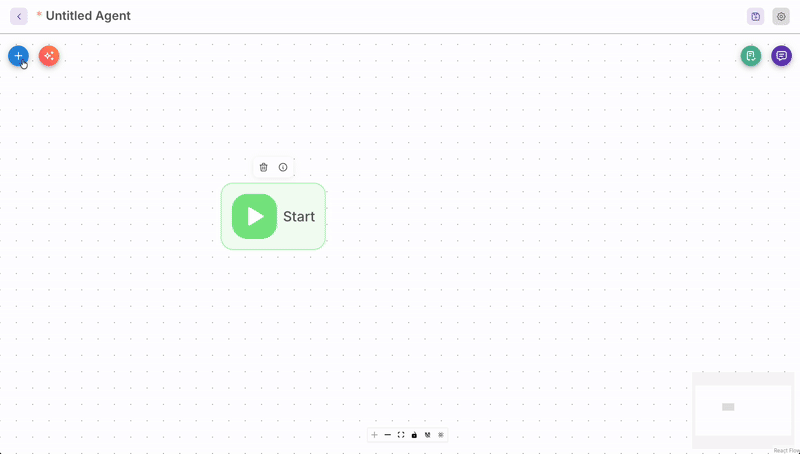

# Chronos - Visual AI agent builder


[](LICENSE.md)
[](chronos_app/.nvmrc)
[](CONTRIBUTING.md)

<div align=center style="padding-bottom: 35px;">

</div>
<div style="page-break-after: always;">&nbsp;</div>


[Chronos](https://intelligex.com/chronos) is a fork of [Flowise](https://github.com/FlowiseAI/Flowise) project - with the goal to maintain a lean visual AI agent builder, focused on self hosted enviroenments, observability and interaction with self hosted data models. It provides:

- Self-hosting focused visual AI agent workflow builder.
- 100+ of prebuilt LLM model integrations and templates.
- Significant focus on observability, logging and local datastores.
- Optimised container images, for local development and hosting.
- Number of [Docker compose examples](./chronos_app/docker/) to get you started.
- Set of [tutorials and how to guides](https://intelligex.com/).

## Quick Start

Chronos is tailored for the deployments on local and self hosted enviroenments. Most convinient way to get started quickly is to run container image (see steps below). For the more complex hosting examples see the [docker compose files](./chronos_app/docker/).

*Build and run a local Docker container image:*

```bash
cd chronos_app/docker
docker build -f Dockerfile.local -t chronos:local ..
docker run -d --name chronos -p 3001:3000 chronos:local
# chronos is now accessable on http://localhost:3001
docker stop chronos
```

## Env Variables

Chronos allows configuration via set of supported environment variables. See example [env variables](chronos_app/docker/.env.example).

## License

Source code in this repository is made available under the [Apache License Version 2.0](LICENSE.md).

## Need Assistance?

We do [provide professional services](https://intelligex.com/about) to deploy, customise and run Chronos visual AI agent builder within your organization enviroenments.
